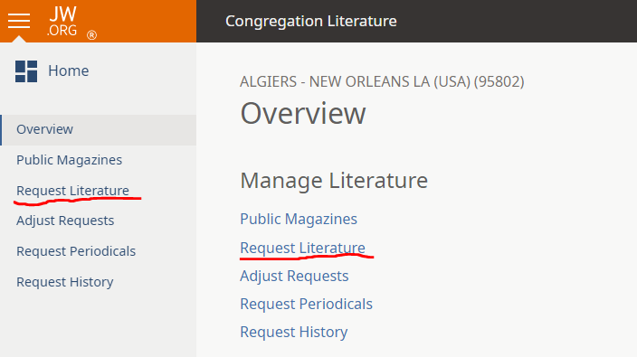
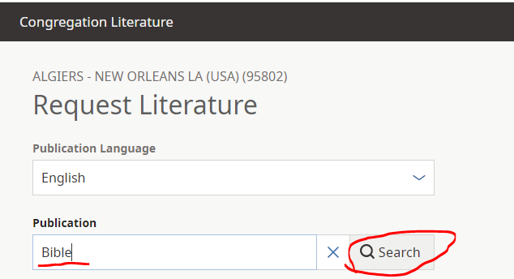
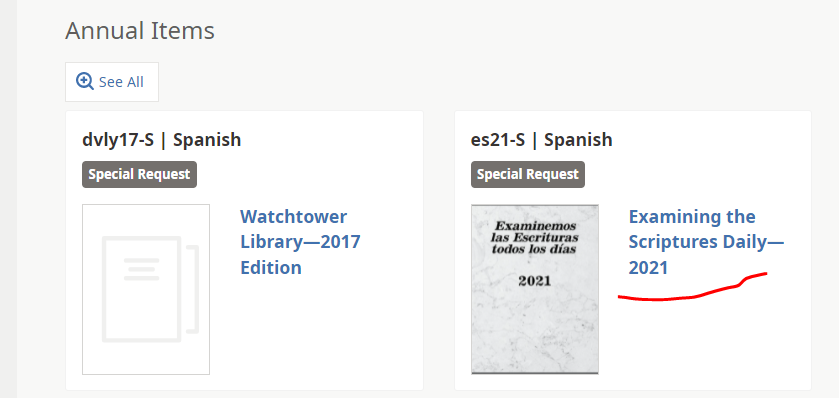

# **Adjust Requests – User Flow**

***
## **User Enters to the feature**



### Load languages
> #### **Request**
>**Method:** GET
>**Url:** [https://my.jw-union.org/congregation-literature/api/request-language/16d13cf5-8b2a-4613-9785-bc91fc0d5144/languages](https://my.jw-union.org/congregation-literature/api/request-language/16d13cf5-8b2a-4613-9785-bc91fc0d5144/languages) 
> #### **Response** (List of languages)
>**Format:**
```json
[
    {
        id: string,
        description: string
    }
]
```

### Load Categories
> #### **Request**
>**Method:** GET
>**Url:** [https://my.jw-union.org/congregation-literature/api/request-literature/16d13cf5-8b2a-4613-9785-bc91fc0d5144/categories](https://my.jw-union.org/congregation-literature/api/request-literature/16d13cf5-8b2a-4613-9785-bc91fc0d5144/categories)
> #### **Response** (List of categories with their subcategories)
>**Format:**
```json
[
    {
        categoryGuid: string,
        description: string,
        sequenceNumber: number
        subcategories: [
            {
                description: string,
                sequenceNumber: number,
                subcategoryGuid: string
            }
        ]
    }
]
```

### Next-cutoff-date
> #### **Request**
>**Method:** GET
>**Url:** [https://my.jw-union.org/congregation-literature/api/request-literature/16d13cf5-8b2a-4613-9785-bc91fc0d5144/next-cutoff-date](https://my.jw-union.org/congregation-literature/api/request-literature/16d13cf5-8b2a-4613-9785-bc91fc0d5144/next-cutoff-date)
> #### **Response** (Next cutoff date)
>**Format:**
```json
{
    nextCutoffDate: string
}
```

### Validate selected language
> #### **Request**
>**Method:** POST
>**Url:** [https://my.jw-union.org/congregation-literature/api/request-language/16d13cf5-8b2a-4613-9785-bc91fc0d5144/bafaf6d8-1e69-47c2-abcb-b3bdfc28eebe/validate](https://my.jw-union.org/congregation-literature/api/request-language/16d13cf5-8b2a-4613-9785-bc91fc0d5144/bafaf6d8-1e69-47c2-abcb-b3bdfc28eebe/validate)
>**Body:** none
> #### **Response**
>**Format:**
```json
{
    CoordinatingCongregationName: string,
    isValid: boolean
}
```

### Browse
> #### **Request**
>**Method:** GET
>**Url:** [https://my.jw-union.org/congregation-literature/api/request-literature/16d13cf5-8b2a-4613-9785-bc91fc0d5144/language/bafaf6d8-1e69-47c2-abcb-b3bdfc28eebe/browse](https://my.jw-union.org/congregation-literature/api/request-literature/16d13cf5-8b2a-4613-9785-bc91fc0d5144/language/bafaf6d8-1e69-47c2-abcb-b3bdfc28eebe/browse)
> #### **Response**
>**Format:**
```json
[
    {
        categoryGuid: string,
        code: string,
        coverImageUrl: string,
        isFeatured: Boolean,
        isSpecialRequest: Boolean,
        IsTeachingToolbox: Boolean,
        itemGuid: string,
        languageGuid: string,
        longTitle: string,
        shouldDisplayImageOnJWOrg: Boolean,
        subcategoryGuid: string
    }
]
```

***

## **User changes language**

### [Load languages](#load-languages)
### [Validate (Validates selected language)](#validate-validates-selected-language)
### If there is a criterion to search call [Search](#search) otherwise call [Browse](#browse)

***
## **User click on See  *All button* for *Teaching Toolbox category***

### Browse teaching toolbox items
> #### **Request**
>**Method:** GET
>**Url:** [https://my.jw-union.org/congregation-literature/api/request-literature/16d13cf5-8b2a-4613-9785-bc91fc0d5144/language/2cadddaf-80d5-472d-b6d9-48cd4dd17a5b/teaching-toolbox](https://my.jw-union.org/congregation-literature/api/request-literature/16d13cf5-8b2a-4613-9785-bc91fc0d5144/language/2cadddaf-80d5-472d-b6d9-48cd4dd17a5b/teaching-toolbox)
>**url includes congregation guid, language guid and category guid**
> #### **Response**
>**Format:**
```json
{
    languageValidationResult: {
        isValid: boolean
    },
    Languages: [
        {
        Id: string,
        Description: string
        }
    ],
    results: [
        {
        categoryGuid: string,
        code: string,
        coverImageUrl: string,
        isFeatured: Boolean,
        isSpecialRequest: Boolean,
        IsTeachingToolbox: Boolean,
        itemGuid: string,
        languageGuid: string,
        longTitle: string,
        shouldDisplayImageOnJWOrg: Boolean,
        subcategoryGuid: string
        }
    ]
}
```

***
## **User click on See *All button* for a specific category**

### Browse category items
> #### **Request**
>**Method:** GET
    - Url: [https://my.jw-union.org/congregation-literature/api/request-literature/16d13cf5-8b2a-4613-9785-bc91fc0d5144/language/32eb9c16-076e-4140-80ed-b5d40c5fe064/category/3b358d32-1463-42c4-a540-b0c80df2db6f/items](https://my.jw-union.org/congregation-literature/api/request-literature/16d13cf5-8b2a-4613-9785-bc91fc0d5144/language/32eb9c16-076e-4140-80ed-b5d40c5fe064/category/3b358d32-1463-42c4-a540-b0c80df2db6f/items)
>**url includes congregation guid, language guid and category guid**
> #### **Response**
>**Format:**
```json
{
    languageValidationResult: 
    {
        isValid: boolean
    },
    category: 
    {
        categoryGuid: string,
        description: string,
        sequenceNumber: number,
        subcategories: 
        [
            {
                description: string,
                sequenceNumber: number,
                subcategoryGuid: string,
            }
        ],
    },
    Languages: 
    [
        {
            Id: string,
            Description: string
        }
    ],
    results: 
    [
        {
            categoryGuid: string,
            code: string,
            coverImageUrl: string,
            isFeatured: Boolean,
            isSpecialRequest: Boolean,
            IsTeachingToolbox: Boolean,
            itemGuid: string,
            languageGuid: string,
            longTitle: string,
            shouldDisplayImageOnJWOrg: Boolean,
            subcategoryGuid: string
        }
    ]
}
```

***

## **User searches publications**



### Search
> #### **Request**
>**Method:** GET
>**Url:** [https://my.jw-union.org/congregation-literature/api/request-literature/16d13cf5-8b2a-4613-9785-bc91fc0d5144/language/bafaf6d8-1e69-47c2-abcb-b3bdfc28eebe/search](https://my.jw-union.org/congregation-literature/api/request-literature/16d13cf5-8b2a-4613-9785-bc91fc0d5144/language/bafaf6d8-1e69-47c2-abcb-b3bdfc28eebe/search)
>**url includes the congregation as well as the selected language**
>**Request body:**
```json
{
    searchTerm: string?
    take: number? [10]
    Offset: number? (used after first search to load more)
}
```
> #### **Response**
>**Format:**
```json
{
    totalResultsCount: number,
    results: 
    [
        {
            categoryGuid: string,
            code: string,
            coverImageUrl: string,
            isFeatured: Boolean,
            isSpecialRequest: Boolean,
            IsTeachingToolbox: Boolean,
            itemGuid: string,
            languageGuid: string,
            longTitle: string,
            shouldDisplayImageOnJWOrg: Boolean,
            subcategoryGuid: string
        }
    ]
}
```

***

## **User clicks on *Load More* button**
> #### **Request**
>**Method:** GET
>**Url:** Same url that [Search](#search) but getting next 10 using Offset parameter to determine the amount loaded.
>**Response:** same that [Search](#search)

***

## **User clear criterion and clicks *search* button**
### [Search](#search)
 
***
## **User clicks on item in results**



## **Open add form.**
## **User enters the requested quantity**
## **Click next button**

### Validates entered quantity for item requested.
> #### **Request**
>**Method:** POST
>**Url:** [https://my.jw-union.org/congregation-literature/api/literature-item-quantity-validation/16d13cf5-8b2a-4613-9785-bc91fc0d5144/item/9c71da44-d037-4510-a8ba-49827d99a090/validate](https://my.jw-union.org/congregation-literature/api/literature-item-quantity-validation/16d13cf5-8b2a-4613-9785-bc91fc0d5144/item/9c71da44-d037-4510-a8ba-49827d99a090/validate)
>**url includes congregation guid as well as item guid.**
>** Request body:**
```json
{
    itemGuid: string
    quantity: number
}
```
>**Response (if applies)**
>**Format**
```json
{
    warning: string,
    newQuantity: number
}
```
## User submit the change
> #### **Request**
>**Method:** POST
>**url:** [https://my.jw-union.org/congregation-literature/api/request-literature/16d13cf5-8b2a-4613-9785-bc91fc0d5144/item/d4ef7912-91d2-405e-97b9-3a02d48afe1e](https://my.jw-union.org/congregation-literature/api/request-literature/16d13cf5-8b2a-4613-9785-bc91fc0d5144/item/d4ef7912-91d2-405e-97b9-3a02d48afe1e)
>**url includes congregation guid as well as item guid.**
>** Request body**
```json
{
    itemGuid: string
    quantity: number,
    notes: string
}
```
>**Response:** none
